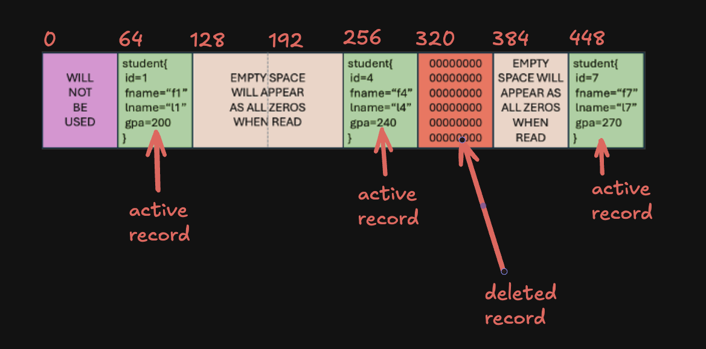

# Assignment Instructions

Due to the size of readme files, this week they are broken into two files. The detailed instructions are here: [directions.md](./directions.md) - read this step-by-step to complete the assignment.

Below you will find additional explanations and content to help with the assignment.

# Concept 1 - the student.db database file layout

The layout of the database file is noted in the instructions. To re-iterate - we have defined how you should implement the file and how data should be stored, but that logic must be implemented in this week's assignment.

The key concept to take away is that each student record will be stored in a specific location in the file (via an offset) **that is determined by the student id**. So if there is only 1 record with id 100, that record begins at 100 * 64 - 64 being the number of bytes the student record occupies. The size of the student record is already determined in the assignment starter, located in the `db.h`.

The actual resultant file in linux terms leverages the linux concept of `sparse files` - the reported size on disk is more like a "reservation" and the real size is based on how much data is stored.



Important - **the zeroed areas are deleted students**. We cannot remove the middle of a file and make it smaller, so we zero it out instead.

# Concept 2 - how do I know student_t takes up 64 bytes?

The struct was explicitly designed to total 64 bytes.

* ints are 4 bytes, so `id` + `gpa` is 8 bytes
* fname is 24 and lname is 32
* 24 + 32 + 8 = 64
* the sizes of fname and lname were explicitly selected so the whole struct would total 64 bytes - this is called `alignment`

```c
typedef struct student{
    int id;
    char fname[24];
    char lname[32];
    int gpa; 
} student_t;
```

# Concept 3 - creation of the initial student.db

The `main()` func in the starter code already handles the database file creation; if it does not exist, it is created. It is always opened for writing by `main()`, so you don't need to worry about that part.

# Concept 4 - file descriptors for student db

When the student.db file is created by the starter code, an int variable for its file descriptor is stored in `fd`:

```c
    fd = open_db(DB_FILE, false);
    if (fd < 0)
    {
        exit(EXIT_FAIL_DB);
    }
```

This is important - the `fd` file descriptor is passed to all the functions you need to implement in the assignment.

# Concept 5 - which functions do I need to implement?

The following functions in the starter code **must be implemented by you**. Each function is "wired up" already for you from `main()`, all the args from argv and the file descriptor `fd` for student.db are already being passed into the functions that require implementation.

- get_student
- add_student
- del_student
- count_db_records
- print_db
- print_student
- compress_db (extra credit)

# Concept 6 - what C funcs will you need to implement your code?

These are the only syscall and linux libc functions you should need to complete the assignment.

**Please review each function's documentation** online or via `man`. 

**Syscalls:**

- open
- close
- read
- write
- lseek

**libc:**

- memcpy
- memcmp
- strncpy
- printf
- perror

# Concept 7 - initializing structs

The functions you must implement accept parameters like id, student name, etc., but do not deal with the `student_t` type directly.

Structs can be initialized in C using this notation, which handles memory allocation:

```c
student_t my_student = {0};
```

# Concept 8 - includes that help working with files

All includes you need for the assignment are already in the starter file.

The `fcntl.h` header file contains constants and typedefs you need for some of the file syscalls. `unistd.h` contains the syscall func definitions.

If you check docs for the syscalls, you will find some of the types that are defined in `fcntl.h`. For example, here is the `lseek()` definition:

```c
off_t lseek(int fd, off_t offset, int whence);
```

Note that it accepts a `off_t` parameter, and returns an `off_t` value. The `off_t` type is defined in `fcntl.h`.

# Concept 9 - coding console messages and error conditions

Each func that needs to be implemented has detailed instructions via its comments. Where applicable they contain all possible return values and "console" messages.

You must write logic that checks for all the defined error conditions, prints the correct messages, and returns the correct value.

For example, `add_student()` defines these return conditions and possible console messages:

```c
 *  returns:  NO_ERROR       student added to database
 *            ERR_DB_FILE    database file I/O issue
 *            ERR_DB_OP      database operation logically failed (aka student
 *                           already exists)  
 * 
 * 
 *  console:  M_STD_ADDED       on success
 *            M_ERR_DB_ADD_DUP  student already exists
 *            M_ERR_DB_READ     error reading or seeking the database file
 *            M_ERR_DB_WRITE    error writing to db file (adding student)
```

So, for example, let's say the user is trying to add a student that already exists in the db file.

The `add_student()` function should print the `M_ERR_DB_ADD_DUP` message, then return with the `ERR_DB_OP` error code.

# Concept 10 - automated testing with pytest

This is very important. **Your solution must pass the tests defined in** `test_sdbsc.py`. 

The test file uses the pytest testing framework. You can install this with `pip3 install pytest --break-system-packages` or run `make install-pytest`. pytest is already installed in `tux`.

Simply run `pytest test_sdbsc.py -v` or `make test` to test your solution. All tests must pass!

# Concept 11 - system call analysis with strace

After completing your implementation, you'll analyze your code's system call behavior using `strace`. This is a **required component** worth 10 points.

**What is strace?**
- Industry-standard tool for tracing system calls
- Shows exactly what system calls your program makes
- Essential for debugging and understanding system behavior
- Used by every professional systems programmer

**Why analyze your database with strace?**
- **Validates implementation**: See the exact system calls (open, lseek, read, write) your code makes
- **Understand sparse files**: Observe how lseek() creates holes in the file
- **Debug issues**: If something doesn't work, strace shows what's actually happening
- **Performance insight**: See how many syscalls different operations require

**What you'll discover:**
- How `lseek()` creates sparse files with "holes"
- The difference between logical file size and physical disk usage
- Exactly which system calls happen when you add/delete/read students
- Why your file can report 6MB size but only use 12K on disk

**Learning approach:**
You'll use AI tools (ChatGPT, Claude, Gemini) to learn strace independently - just like you learned Valgrind and Wireshark in previous assignments. This teaches you to research professional tools on your own.

See [strace-analysis.md](strace-analysis.md) for complete instructions.

# Demo - lets implement parts of add_student and print_db

Demo partial implementation with guided explanation.

Here is the code that was created during the demo:

```c
int add_student(int fd, int id, char *fname, char *lname, int gpa)
{
    printf("todo: add student id %d name %s %s with gpa %d\n", id, fname, lname, gpa);

    student_t mystudent = {0};
    off_t myoffset;

    // todo check if the student exists already
    // ? if yes, print dup error msg and return db op error
    // ? if no, no error continue on with adding student

    myoffset = id * STUDENT_RECORD_SIZE;
    printf("need to add student id %d at offset %ld\n", id, myoffset);

    // todo - populate the student struct for writing to db
    mystudent.id = id;
    mystudent.gpa = gpa;
    //                dest   source  how-many-to-take
    strncpy(mystudent.fname, fname, sizeof(mystudent.fname));
    strncpy(mystudent.lname, lname, sizeof(mystudent.lname));

    off_t lseek_result = lseek(fd, myoffset, SEEK_SET);
    if (lseek_result < 0)
    {
        // todo print the db read error message
        // todo return the db file error code
    }

    ssize_t bytes_written = write(fd, &mystudent, STUDENT_RECORD_SIZE);
    if (bytes_written < 0) // TODO - what is the other condition you should check about bytes_written
    {
        // todo print the db write error message
        // todo return the db file error code
    }

    // if we get here, the student was added
    printf(M_STD_ADDED, id);
    return NO_ERROR;
}
```