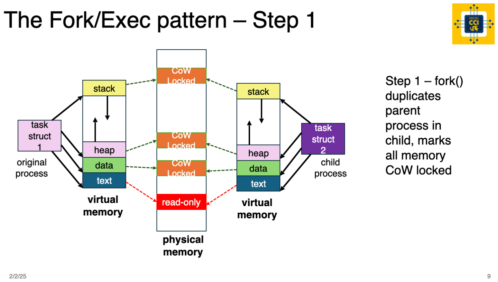

# Assignment: Custom Shell Part 2 - Fork/Exec

This week we'll build on your `dsh` (Drexel Shell) by adding command execution using the fork/exec pattern. You'll implement the `cd` built-in command and execute external commands.

**Important:** Part 2 focuses on **single command execution only**. No pipes, no redirection - just master fork/exec/waitpid.

---

## Building on Part 1: Software Engineering Practice

One critical software engineering skill is **building on your existing work**. You already have working code from Part 1 - reuse it!

**What to copy from Part 1:**
- `build_cmd_buff()` - Your command parsing function
  - Takes a command string and populates `cmd_buff_t`
  - Handles spaces, quotes, and arguments
  - You already implemented this!

**What's new in Part 2:**
- `exec_cmd()` - Fork/exec pattern to execute commands
- `exec_built_in_cmd()` - Implement `cd` command
- `exec_local_cmd_loop()` - New main loop focused on execution

**What's NOT in Part 2:**
- No pipes (`|`) - comes in Part 3
- No redirection (`>`, `<`) - comes later
- No `command_list_t` - just single `cmd_buff_t`
- Only ONE command at a time

---

## Fork / Exec: The Foundation of Unix

Let's introduce two fundamental system calls: `fork()` and `exec()`. These calls are fundamental to process creation and execution in all Unix-like operating systems.

### Understanding Fork

When a process calls `fork()`, the operating system creates a new child process that is an exact copy of the parent, inheriting its memory, file descriptors, and execution state.

**Key points:**
- Child process receives return value of `0` from `fork()`
- Parent receives the child's process ID (PID)
- Both processes continue executing from the fork point

### Understanding Exec

After forking, the child process replaces its memory image with a new executable using one of the `exec()` family of functions (e.g., `execvp()`).

**Key points:**
- `exec()` does NOT create a new process
- It REPLACES the calling process's memory with a new program
- File descriptors are preserved
- If `exec()` returns, it failed (command not found, etc.)

### The Fork/Exec Pattern

This mechanism allows Unix shells to execute programs:
1. Shell forks a child process
2. Child uses `exec()` to run the desired binary
3. Parent waits for child to complete using `waitpid()`




**Key concepts:**
- Parent continues after fork, child starts from fork point
- Child gets PID 0 from fork(), parent gets child's actual PID
- execvp() replaces child's memory with new program
- Parent waits for child using waitpid()
- Child's exit code extracted with WEXITSTATUS macro

### Demo Code Reference

Review the fork/exec pattern from lecture: https://github.com/drexel-systems/SysProg-Class/blob/main/demos/process-thread/2-fork-exec/fork-exec.c

In the demo we used `execv()`, which requires an absolute path. In this assignment use `execvp()` - it searches the `PATH` environment variable for binaries.

---

## Assignment Details

### Step 1 - Review [./starter/dshlib.h](./starter/dshlib.h)

Review the header file before you start coding.

**Key changes from Part 1:**
- Only using `cmd_buff_t` (not `command_list_t`)
- New built-in commands: `cd`, `rc` (extra credit)
- Prompt changed to "dsh2>" to indicate Part 2

**The `cmd_buff_t` structure:**

```c
typedef struct cmd_buff {
    int  argc;              // Number of arguments
    char *argv[CMD_ARGV_MAX]; // Array of argument strings
    char *_cmd_buffer;      // Internal buffer
} cmd_buff_t;
```

Example:
- Input: `"ls -la /tmp"`
- Result: `argc=3, argv=["ls", "-la", "/tmp", NULL]`

---

### Step 2 - Copy Your Part 1 Parsing Code

**Reuse your `build_cmd_buff()` function from Part 1!**

This function takes a single command string and parses it into `cmd_buff_t`. You already implemented this!

**What it should handle:**

1. **Trim ALL leading and trailing spaces**
   - Input: `"  ls  "` → Command: `"ls"`

2. **Eliminate duplicate spaces UNLESS in quotes**
   - Input: `"ls    -la"` → Args: `["ls", "-la"]`
   - Input: `"echo  'hello    world'"` → Args: `["echo", "hello    world"]`

3. **Handle quoted strings**
   - Quoted string with spaces = single argument
   - Example: `echo "hello    world"` → Args: `["echo", "hello    world"]`
   - Spaces inside quotes are preserved!

4. **Support both single and double quotes**
   - Single quotes: Preserve everything literally
   - Double quotes: Preserve spaces

**Critical requirement:**
- `argv[argc]` MUST be NULL (required for execvp!)

---

### Step 3 - Implement `cd` Built-in Command

Implement the `cd` command in `exec_built_in_cmd()`.

**Requirements:**
- No arguments: do nothing (don't change directory)
- One argument: use `chdir()` to change directory
- Print error if `chdir()` fails

**System call:**
```c
int chdir(const char *path);
// Returns 0 on success, -1 on error
```

See `man 2 chdir` for details.

**Example implementation pattern:**
```c
case BI_CMD_CD:
    if (cmd->argc < 2) {
        // No argument - do nothing
        return BI_EXECUTED;
    }
    if (chdir(cmd->argv[1]) != 0) {
        perror("cd");
    }
    return BI_EXECUTED;
```

**Why cd must be built-in:**

If `cd` were external:
1. Shell forks child process
2. Child runs `cd /tmp` - changes child's directory
3. Child exits
4. Parent's directory unchanged!

Built-in commands modify the shell itself, so they run in the shell's process.

---

### Step 4 - Implement Fork/Exec in `exec_cmd()`

Implement the fork/exec pattern to execute external commands.

**Algorithm:**

```c
int exec_cmd(cmd_buff_t *cmd)
{
    // 1. Fork the process
    pid_t pid = fork();
    
    // 2. Check fork result
    if (pid < 0) {
        // Fork failed
        perror("fork");
        return ERR_EXEC_CMD;
    }
    else if (pid == 0) {
        // 3. Child process - execute command
        execvp(cmd->argv[0], cmd->argv);
        
        // If execvp returns, it failed
        perror("execvp");
        exit(EXIT_FAILURE);
    }
    else {
        // 4. Parent process - wait for child
        int status;
        waitpid(pid, &status, 0);
        
        // 5. Extract exit code
        if (WIFEXITED(status)) {
            return WEXITSTATUS(status);
        }
        return ERR_EXEC_CMD;
    }
}
```

**System calls you'll use:**
- `fork()` - Create child process
- `execvp()` - Execute command (searches PATH)
- `waitpid()` - Wait for specific child process
- `WEXITSTATUS()` - Extract exit code from status
- `WIFEXITED()` - Check if child exited normally

**Important notes:**
- `execvp()` searches directories in `PATH` environment variable
- `argv` must be NULL-terminated (argv[argc] == NULL)
- If `execvp()` returns, it failed
- Parent must wait for child to avoid zombie processes

---

### Step 5 - Implement Main Loop in `exec_local_cmd_loop()`

Create the main shell loop that reads input and executes commands.

**Algorithm:**

```c
int exec_local_cmd_loop()
{
    char cmd_line[SH_CMD_MAX];
    cmd_buff_t cmd;
    
    // Allocate cmd_buff
    if (alloc_cmd_buff(&cmd) != OK) {
        return ERR_MEMORY;
    }
    
    while (1) {
        // 1. Print prompt
        printf("%s", SH_PROMPT);
        
        // 2. Read input
        if (fgets(cmd_line, SH_CMD_MAX, stdin) == NULL) {
            printf("\n");
            break;
        }
        
        // 3. Remove trailing newline
        cmd_line[strcspn(cmd_line, "\n")] = '\0';
        
        // 4. Check for exit command
        if (strcmp(cmd_line, EXIT_CMD) == 0) {
            printf("exiting...\n");
            break;
        }
        
        // 5. Parse command
        int rc = build_cmd_buff(cmd_line, &cmd);
        if (rc != OK || cmd.argc == 0) {
            continue; // Empty or parse error
        }
        
        // 6. Check if built-in
        Built_In_Cmds bi = exec_built_in_cmd(&cmd);
        if (bi == BI_CMD_EXIT) {
            printf("exiting...\n");
            break;
        }
        if (bi == BI_EXECUTED) {
            continue; // Built-in was executed
        }
        
        // 7. Execute as external command
        exec_cmd(&cmd);
    }
    
    free_cmd_buff(&cmd);
    return OK;
}
```

**Key points:**
- Use single `cmd_buff_t` (not command list)
- Check built-ins before fork/exec
- Exit command can be typed or match EXIT_CMD

---

### Step 6 - System Call Analysis with strace

**Points: 10 (REQUIRED)**

Use `strace` to analyze your fork/exec implementation and understand how processes work at the OS level.

**What You'll Do:**
1. Use AI tools to learn `strace` for process tracing
2. Trace your shell's fork/exec operations
3. Analyze parent vs child process behavior
4. Investigate how execvp() searches PATH
5. Document your findings and learning process

**Why This Matters:**
- **Validates your implementation**: See exact system calls your code makes
- **Industry-standard tool**: Every systems programmer uses strace
- **Understand processes**: See fork creates processes, exec replaces them
- **PATH investigation**: Observe how shell finds commands
- **Professional skill**: Essential for systems debugging

**Deliverable:**
Create `strace-fork-exec-analysis.md` following the instructions in [strace-fork-exec-analysis.md](strace-fork-exec-analysis.md).

**What You'll Analyze:**
- Fork system call creating child process
- Child and parent process IDs
- execvp() searching PATH directories
- waitpid() parent waiting for child
- Exit codes and WEXITSTATUS

See [strace-fork-exec-analysis.md](strace-fork-exec-analysis.md) for complete instructions.

---

## Sample Run with Sample Output

Commands now execute and produce actual output (different from Part 1):

```bash
./dsh 
dsh2> uname -a
Linux ubuntu 6.12.10 #42 SMP aarch64 GNU/Linux
dsh2> uname
Linux
dsh2> echo "hello,      world"
hello,      world
dsh2> pwd
/home/student/04-ShellP2
dsh2> ls
dragon.c  dsh  dsh_cli.c  dshlib.c  dshlib.h  makefile  test_dsh2.py
dsh2> cd dir1
dsh2> pwd
/home/student/04-ShellP2/dir1
dsh2> cd ..
dsh2> pwd
/home/student/04-ShellP2
dsh2> exit
exiting...
cmd loop returned 0
```

**Note:** Commands actually execute! This is the difference from Part 1.

---

## Extra Credit: +10 Points

Implement return code handling and the `rc` built-in command.

### Requirements

1. **Capture and store the return code from last command**
   - Store in global or static variable
   - Update after each command execution

2. **Handle exec errors with specific messages:**
   - `ENOENT` - "Command not found in PATH"
   - `EACCES` - "Permission denied"
   - Other errors as appropriate

3. **Implement `rc` built-in that prints last return code:**
   ```bash
   dsh2> ls
   [files listed]
   dsh2> rc
   0
   dsh2> not_a_command
   Command not found in PATH
   dsh2> rc
   2
   ```

### Implementation Hints

**In child process after execvp fails:**
```c
if (errno == ENOENT) {
    fprintf(stderr, "Command not found in PATH\n");
    exit(127); // Standard shell exit code
}
else if (errno == EACCES) {
    fprintf(stderr, "Permission denied\n");
    exit(126);
}
```

**In parent process:**
```c
static int last_return_code = 0;

// After waitpid
if (WIFEXITED(status)) {
    last_return_code = WEXITSTATUS(status);
}
```

**rc built-in:**
```c
case BI_CMD_RC:
    printf("%d\n", last_return_code);
    return BI_EXECUTED;
```

**Why this matters:**
This is a precursor to implementing variables. Shells set `$?` to the last command's return code. We're implementing `rc` as a simpler version.

---

## Grading Rubric

**Total: 70 points (80 with extra credit)**

### Implementation (45 points)
- Fork/exec pattern (20 pts)
  - Correct fork usage
  - Proper execvp call
  - Parent waits with waitpid
  - Exit code handling
- cd built-in (10 pts)
  - Works with argument
  - Does nothing without argument
  - Error handling
- Quote handling (10 pts)
  - Single and double quotes
  - Spaces preserved in quotes
  - Quotes removed from arguments
- Exit command (5 pts)
  - Exits cleanly
  - Proper cleanup

### Code Quality (5 points)
- Readable code with clear variable names
- Comments explaining logic
- Proper error checking
- Good organization

### strace Analysis (10 points)
- Learning process (2 pts)
- Basic fork/exec analysis (3 pts)
- PATH search investigation (3 pts)
- Process verification (2 pts)

### Extra Credit (10 points)
- Return code capture (3 pts)
- Error-specific messages (3 pts)
- rc built-in implementation (4 pts)

**Total achievable: 80/70**

---

## Submission Requirements

All files in `04-ShellP2/` directory in your GitHub Classroom repository.

**Required Files:**
1. `dshlib.c` - Your implementation
2. `dshlib.h` - If you added functions
3. `dsh_cli.c` - Should not need changes
4. `dragon.c` - If you did Part 1 extra credit
5. `strace-fork-exec-analysis.md` - Your strace analysis
6. All provided files (`makefile`, etc.)

**Before submitting:**
```bash
make clean && make           # Compile
pytest test_dsh2.py -v       # Test (all must pass)
git add 04-ShellP2/
git commit -m "Complete shell part 2"
git push origin main
```

Submit your repository URL on Canvas.

---

## Testing

Install pytest:
```bash
pip3 install pytest --break-system-packages
# or
make install-pytest
```

Run tests:
```bash
pytest test_dsh2.py -v
# or
make test
```

**Tests verify:**
- Fork/exec executes commands
- cd changes directory
- Quoted strings work
- Commands produce actual output
- Exit works

All tests must pass for full credit!

---

## Tips for Success

### Getting Started

1. **Copy Part 1 parsing first** - Get `build_cmd_buff()` working
2. **Implement cd** - Simplest feature, good warm-up
3. **Basic fork/exec** - Get one command working
4. **Quote handling** - Make parsing robust
5. **strace analysis** - Understand what you built

### Debugging Fork/Exec

Use printf debugging:
```c
printf("Parent: about to fork\n");
pid_t pid = fork();
if (pid == 0) {
    printf("Child: executing %s\n", cmd->argv[0]);
    execvp(cmd->argv[0], cmd->argv);
    printf("Child: execvp failed!\n");
} else {
    printf("Parent: waiting for child %d\n", pid);
    waitpid(pid, &status, 0);
    printf("Parent: child exited\n");
}
```

### Common Mistakes

**Missing NULL terminator:**
```c
// WRONG
cmd->argv[cmd->argc] = cmd->argv[0];

// RIGHT
cmd->argv[cmd->argc] = NULL; // Required for execvp!
```

**Not checking fork:**
```c
// WRONG
fork();
execvp(...); // Both parent and child execute!

// RIGHT
pid_t pid = fork();
if (pid == 0) {
    execvp(...); // Only child executes
}
```

**Forgetting to wait:**
```c
// WRONG
if (pid > 0) {
    // Parent continues - child becomes zombie!
}

// RIGHT
if (pid > 0) {
    waitpid(pid, &status, 0);
}
```

### Quote Handling

Shells preserve spaces in quotes:
- `echo hello world` → 3 args: ["echo", "hello", "world"]
- `echo "hello world"` → 2 args: ["echo", "hello world"]

This allows filenames with spaces to work correctly.

---

## Important Reminders

**Part 2 Scope:**
- Single commands
- Fork/exec execution
- Built-in cd
- Quote handling
- No pipes (Part 3)
- No redirection (later)

**Software Engineering:**
- Build on your Part 1 code
- Don't rewrite what already works
- Copy, adapt, integrate
- This is how real development works!

---

Good luck! This assignment teaches you how all programs on Unix systems are started. Every time you run `ls`, `gcc`, or any command, your shell does exactly what you're implementing this week!