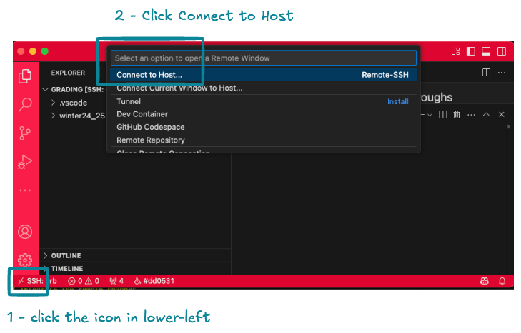
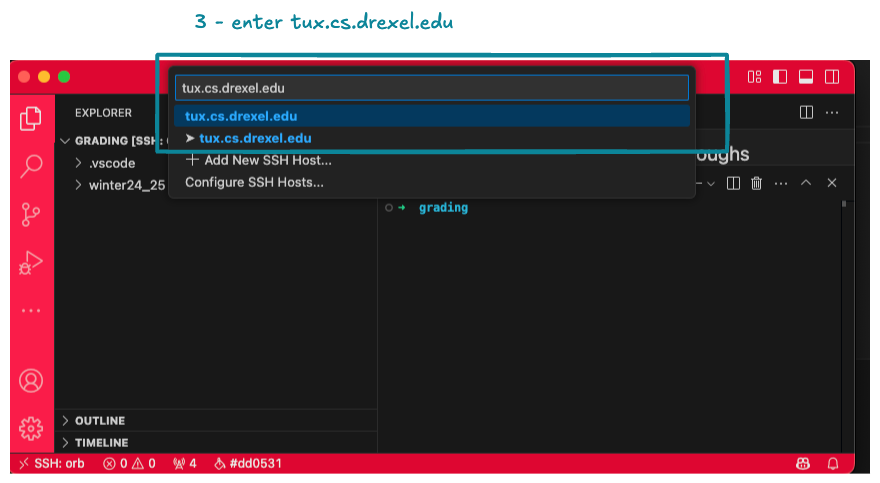
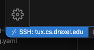
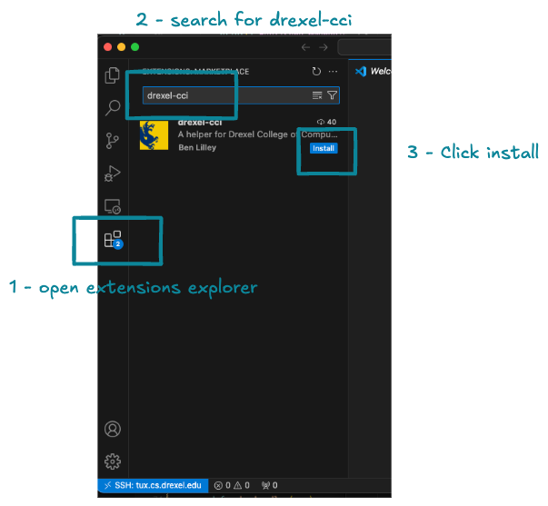
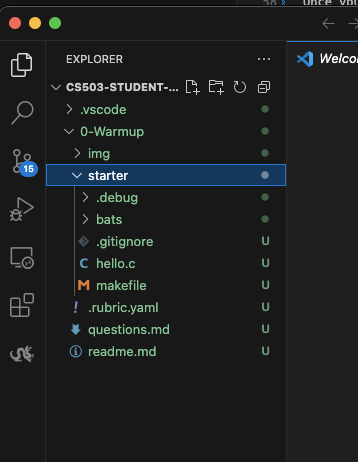

## Course Repository for Systems Programming Class

#### Introduction

For this course we will use private github.com repos in a Drexel student organization on github.com.

In the first week of class you will receive 3 emails related to github: 2 from me with instructions, and 1 from github.com inviting you to our student org. Use these email instructions to set up access and clone the repo.

#### Development IDE

You are free to use any IDE you chose, but I highly reccomend vscode - https://code.visualstudio.com/download. All of my instructions and demos will be performed with vscode. We also have an extension to help with assignment management - https://marketplace.visualstudio.com/items?itemName=bdlilley.drexel-cci. You can install from the webpage, or by searching for it in the extensions manager in vscode.

#### Using your Github repo - step 1 accept org invite

* You will receive an email from your professor with the subjet "CS-503 Github.com Invitation". Refernce the instructions in the email to accept your github.com invitation.
  * The actual invite link you need comes from `noreply@github.com` and will have a subject like "[GitHub] @bdlilley has invited you to join the @drexel-systems-students-cs503 organization".
  * Use the instructions in the "CS-503 Github.com Invitation" email to accept the invitation in the `noreply@github.com` email.

#### Using your Github repo - step 2 access your repo

* After you have accepted the org invite and can log into github.com, follow the intructions in the email titled "CS-503 Github.com Repo Information" from your professor.
* Keeping in mind that a linux environment is required, you should follow the steps in this email from within your linux virtualization platform of choice:

**Option 1 - Drexel Tux**

Tux is a linux cluster provided by the university that you all have access to by default. You should be able to access it by proving your Drexel ID name and password (the one you use for Drexel Connect). 

If you have any trouble accessing Tux, see https://support.cci.drexel.edu/cci-virtual-lab-resources/tux/tux-service.

For vscode, you can use the Tux environment with a remote ssh connection in vscode:

> tip - if you don't see the icon in the lower left, install https://marketplace.visualstudio.com/items?itemName=ms-vscode-remote.remote-ssh in vscode

> you will be prompted for your Drexel username and password

After you have connect you should see this in the lower left:

**Option 2 (mac only) - Orbstack**

If you use a mac, I highly recommend https://orbstack.dev/. Use the documentaiton or google how to create an Ubuntu VM. 

Once you create a VM, you can access it in the same way as Tux within vscode.

**Option 3 - (windows only) - WSL**

On windows you can use WSL https://learn.microsoft.com/en-us/windows/wsl/install. Follow the instructions to set up an Ubuntu environment.

Once you set up WSL, you can access it in the same way as Tux within vscode.

**git commands**

Once you have vscode connected to a linux environment, follow the instructions in the emails you received from your professor to configure git and clone your repository.

#### Using your Github repo - submitting assignments

If you've made it this far following the email instructions, you have cloned your personal student repo and are ready to add and commit files. 

Again, to add files I highly reccomend the extension  https://marketplace.visualstudio.com/items?itemName=bdlilley.drexel-cci. This will save you a lot of time and potential errors.

Here is how to install the extension in your linux env:

> tip - if you are not in a linux env, or you do not have all required tools installed, you will get a warning message from vscode with instructions on how to install

Once installed, you can see available assignments and click "pull" to pull them:

After you pull an assignment, you will see it in the root of your repostory:

You should not remove or reorganize any of the files that are pulled. Please preserve all file names and hierarchy as-is. You can add new files and modify existing files as-needed. 

Many assignments contains starter code to get you started. Make sure you use what is provided!

#### If you don't use the extension ... 

Again, you are free to use any tooling you wish. As noted in the syllabus, if you do use other tools, you are responsible for using the directory structure and naming I have noted. If  you rename or reorganize files, your submission will not be graded and you will be asked to resubmit.

Lastly - week 1 lecture is always a walkthrough of how to perform the steps to submit an assignment. If you're still stuck, please watch the recording or reach out in Discord or via email.